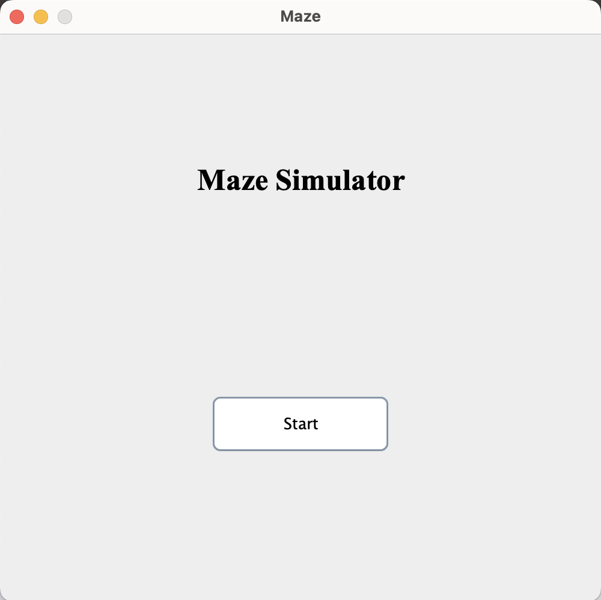
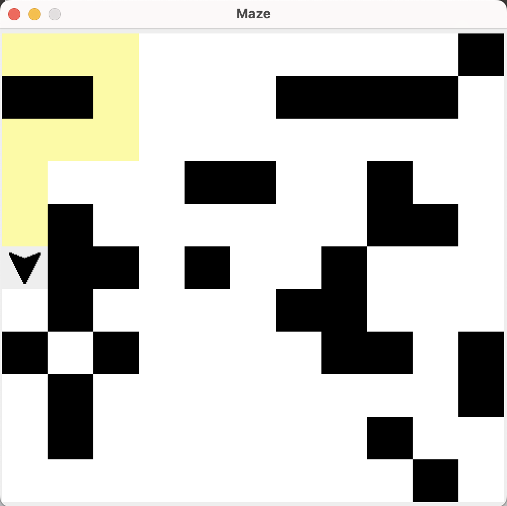

# Java Swing base Maze Simulator

## 시작 화면

start를 누르면 5 ~ 19의 랜덤 크기의 미로가 생성됩니다.  
해당 미로의 벽 또한 랜덤으로 지정됩니다.

해당 버튼을 통해 여러개의 Simulation을 실행 할 수 있습니다.  
각 Simulation은 독립적입니다.

## 실행 화면

화살표가 우수법을 기반으로 이동을 하며 이동한 칸에 대하여는 노란색으로 표기됩니다.  
해당 화살표가 목표지점에 도착하면 Success 메시지가 뜨고 아니라면 Fail 메시지가 뜨게 됩니다.  

실행 화면을 종료하여도 프로그램은 종료되지 않습니다.  
프로그램 종료시 메인화면을 종료해 주세요.